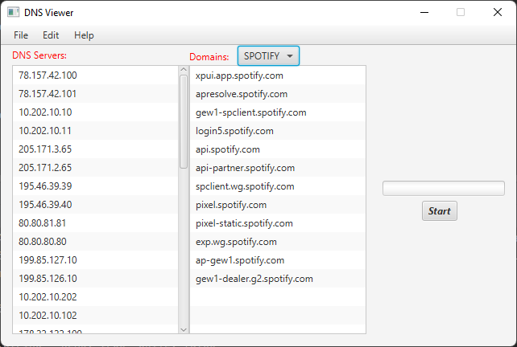

# DNS Benchmark & Viewer

This project is a DNS benchmarking tool. It measures DNS performance across multiple servers by performing lookups and testing IPs for selected domains (e.g., Spotify) and collecting detailed statistics.

---

## Why Use This Tool?

Different DNS servers can return different IP addresses for the same domain depending on your location, network, or the DNS provider’s infrastructure. These IPs might route you through different data centers, CDNs, or networks, affecting real-world performance.

This tool allows you to:

- Benchmark multiple DNS servers side by side
- Perform DNS lookups for specific domains (e.g., Spotify, Google, YouTube)
- Measure the latency of the IP addresses returned by each DNS server, rather than just the DNS response time
- Collect detailed statistics including:
    - Success Rate
    - Lookup Success Percentage
    - Latency Score (based on different percentiles)
- Visualize results with charts and graphs
- Supports domain-specific testing (e.g., Spotify, Google, YouTube)


By testing the actual network latency to the IPs returned by different DNS providers, you can identify which DNS server:

- Connects you to faster endpoints for the services you use
- Routes your traffic through the best-performing data centers
- Improves load times and responsiveness for your specific usage patterns

In the visualizations:
- The two green markers represent the best-performing DNS servers.
- The yellow markers indicate DNS servers with acceptable but not ideal performance.
- All other markers indicate DNS servers that perform poorly in comparison.

This makes it possible to choose the best DNS servers based on real network performance, tailored to the services that matter most to you.

---

## Latency Score Calculation

The Latency Score is calculated as a weighted sum of different latency measures using the following formula:

```math
Latency Score = 0.3 × Average + 0.4 × Percentile(50) + 0.2 × Percentile(90) + 0.1 × Percentile(99)
```

---

## Requirements

- Java 17 or newer
- JavaFX SDK (already included in the project)
- Gradle (for builds, and running)

--- 

## Getting Started

### Build and Run

#### Running Inside IDE or Using Gradle Wrapper

To build and run the project inside your IDE or from the command line using Gradle:

1. Open a terminal or command prompt.
2. Navigate to the root folder of the project (where `build.gradle` is located).
3. Run the following command:

```bash
./gradlew run 
```
or
```bash
gradlew run
```

---

## Screenshots

- DNS Viewer UI
<p align="center">
  
</p>

- DNS Benchmark Visualization
<p align="center">
  
</p>

- DNS Node Details
<p align="center">
  
</p>
